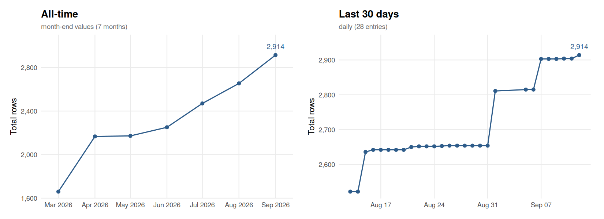

# FORRT Replication Database (FReD) — Data Processing & API

This repository contains the complete data processing pipeline for the **FORRT Replication Database (FReD)** and **FLoRA** datasets, plus the backend API for the Zotero Replication Checker plugin.

## 📋 Table of Contents

- [Overview](#overview)
- [Repository Structure](#repository-structure)
- [Quick Start](#quick-start)
- [Data Processing Pipelines](#data-processing-pipelines)
  - [FReD Pipeline (Effect-level)](#fred-pipeline-effect-level)
  - [FLoRA Pipeline (Paper-level)](#flora-pipeline-paper-level)
- [COS Integration](#cos-integration)
- [API Documentation](#api-documentation)
- [Contributing](#contributing)

---

## Overview

This repository manages two independent datasets:

1. **FReD** (FORRT Replication Effects Database)
   - Effect-level data: individual effect sizes from replications
   - Created by merging individual effects with paper-level success coding
   - Output: `output/FReD.xlsx`

2. **FLoRA** (FORRT Literature on Replications and Reproductions Archive)
   - Paper-level data: metadata about replication and reproduction studies
   - Combines both replications and reproductions from two separate Google Sheets
   - Deduplicated by original-replication/reproduction DOI pairs
   - Enriched with keywords and language metadata from OpenAlex
   - Output: `output/flora.csv`

Both datasets are augmented with:
- CrossRef metadata (titles, authors, years)
- APA-formatted references with manual override support
- Author overlap detection
- OpenAlex keywords

The datasets power the **Zotero Replication Checker** API backend via privacy-preserving DOI hash lookups.

---

## Repository Structure

```
fred_data/
├── R/                              # Shared helper functions
│   ├── cache_config.R              # Cache paths by data type
│   ├── data_cleaning.R             # FReD data cleaning
│   ├── crossref_cache.R            # Citation & author caching
│   ├── augmentation.R              # Augmentation functions
│   └── release_helpers.R           # OSF release automation
│
├── pipelines/                      # Independent data pipelines
│   ├── fred/
│   │   ├── prepare_fred.qmd        # Download → clean → augment → save
│   │   └── release_fred.qmd        # Release to OSF (optional)
│   │
│   └── flora/
│       ├── prepare_flora.qmd       # Download → deduplicate → augment → save
│       └── release_flora.qmd       # Release to OSF (optional)
│
├── cache/                          # Cache files (gitignored)
│   ├── crossref_doi_cache.rds      # DOI metadata
│   ├── crossref_citations.rds      # APA/BibTeX references
│   ├── crossref_authors.xlsx       # Author lists
│   ├── author_overlap.xlsx         # Overlap calculations
│   ├── manual_references.xlsx      # Manual reference overrides
│   └── openalex_keywords.csv       # Keywords cache
│
├── output/                         # Generated datasets (gitignored)
│   ├── FReD.xlsx                   # Effect-level dataset
│   └── flora.csv                   # Paper-level dataset
│
├── cos_integration/                # COS test data (optional)
│   ├── cos_test_set_phase1.csv
│   ├── cos_test_set_phase1_prepared.xlsx
│   ├── prepare_cos_data.R
│   └── README.md                   # COS toggle instructions
│
├── fred_dynamodb_loader/           # API backend loader
├── release/                        # Release automation scripts
├── COS Reports/                    # COS competition reports
├── archive/                        # Historical files
│   └── old_scripts/                # Previous pipeline versions
│
└── [Documentation files]
    ├── README.md                   # This file
    ├── .env.example                # Environment variables template
    ├── REORGANIZATION_PROGRESS.md
    ├── PHASE2_SUMMARY.md
    ├── PHASE3-4_SUMMARY.md
    └── IMPLEMENTATION_STATUS.md
```

---

## Quick Start

### Installation

```bash
# Clone repository
git clone https://github.com/forrtproject/FReD-data.git
cd fred_data

# Set up environment variables
cp .env.example .env
# Edit .env and add:
# - OSF_TOKEN (for releases)
# - ENABLE_COS_MERGE (TRUE/FALSE)
# - OPENALEX_MAILTO (your email for API)

# Install R dependencies (one-time setup)
Rscript -e "install.packages(c('tidyverse', 'readxl', 'openxlsx', 'rcrossref', 'osfr', 'quarto'))"
```

### Running Pipelines

```bash
# Prepare FReD (effect-level dataset)
quarto render pipelines/fred/prepare_fred.qmd

# Prepare FLoRA (paper-level dataset)
quarto render pipelines/flora/prepare_flora.qmd

# Output files created:
# - output/FReD.xlsx (effect-level data with augmentation)
# - output/flora.csv (paper-level data with augmentation)
```

---

## Data Processing Pipelines

### FReD Pipeline (Effect-level)

**File**: `pipelines/fred/prepare_fred.qmd`

**8-step process**:

1. **Load helpers** - Source R functions for cleaning and augmentation
2. **Download** - Fetch validated FReD data from Google Sheets
3. **COS Integration** (optional) - Merge COS Phase 1 test data if enabled
4. **Clean** - Standardize formatting, remove duplicates, fix DOIs
5. **Validate** - Check data quality (ready when validation module complete)
6. **Generate IDs** - Create fred_id, entry_id, effect_id
7. **Augment**:
   - Author overlap detection (% shared authors)
   - Clean references (APA-formatted with manual overrides)
   - Keywords from OpenAlex (optional)
8. **Save** - Output to `output/FReD.xlsx`

**Run**:
```bash
# Without COS data (default)
quarto render pipelines/fred/prepare_fred.qmd

# With COS data merged
export ENABLE_COS_MERGE=TRUE
quarto render pipelines/fred/prepare_fred.qmd

# Output: output/FReD.xlsx
# HTML report: pipelines/fred/prepare_fred.html
```

### FLoRA Pipeline (Paper-level: Replications + Reproductions)

**File**: `pipelines/flora/prepare_flora.qmd`

**12-step process**:

1. **Load helpers** - Source R functions for augmentation
2. **Download & Combine** - Fetch both replications and reproductions from Google Sheets, combine on common columns
3. **Prepare** - Select relevant columns
4. **Deduplicate** - Remove duplicate (doi_o, doi_r) pairs
5. **Validate DOIs** - Ensure format starts with "10."
6. **Fetch metadata** - CrossRef/DataCite lookup (framework ready)
7. **Augment with references** - Clean references (APA-formatted with manual overrides)
8. **Add IDs** - Privacy-preserving 3-char DOI hash prefixes
9. **Add language & keywords** - Fetch from OpenAlex API (only fills empty fields)
10. **Format** - Reorder columns for output (includes keywords and language)
11. **Save** - Output to `output/flora.csv`
12. **Summary** - Report statistics on papers, coverage, and augmentation success

**Run**:
```bash
quarto render pipelines/flora/prepare_flora.qmd

# Output: output/flora.csv
# HTML report: pipelines/flora/prepare_flora.html
```

---

## Helper Functions

All helper functions are in `R/` and ready to use:

### Data Cleaning (`R/data_cleaning.R`)
- `clean_fred_data(data)` - Standardize formatting, fix DOIs, remove non-printable characters

### CrossRef Caching (`R/crossref_cache.R`)
- `get_apa_references(dois)` - Get APA references (manual → cache → API lookup)
- `get_crossref_authors(dois)` - Fetch author lists from CrossRef
- `compute_author_overlap(data)` - Calculate author overlap

### Augmentation (`R/augmentation.R`)
- `augment_with_author_overlap(data)` - Add author overlap columns
- `augment_with_clean_references(data)` - Add APA reference columns
- `augment_with_keywords(data)` - Add OpenAlex keywords

### Release (`R/release_helpers.R`)
- `release_to_osf(dataset_path, ...)` - Release dataset to OSF with versioning

**Usage**:
```r
source("R/augmentation.R")

# Augment data
data <- augment_with_author_overlap(data)
data <- augment_with_clean_references(data)
data <- augment_with_keywords(data)
```

---

## COS Integration

COS (Collaborative Open Science) Phase 1 test data can be optionally merged with FReD.

### Enabling COS Integration

```bash
# Method 1: Environment variable
export ENABLE_COS_MERGE=TRUE
quarto render pipelines/fred/prepare_fred.qmd

# Method 2: .env file
# Edit .env and set: ENABLE_COS_MERGE=TRUE
quarto render pipelines/fred/prepare_fred.qmd

# Disable (default)
export ENABLE_COS_MERGE=FALSE
quarto render pipelines/fred/prepare_fred.qmd
```

### How It Works

When `ENABLE_COS_MERGE=TRUE`:
1. FReD pipeline downloads main dataset
2. Merges with COS data on common columns
3. Both processed identically (cleaning, validation, augmentation)
4. Single output: `FReD.xlsx` with both datasets

**See**: `cos_integration/README.md` for detailed instructions

---

## Caching Strategy

All caches are organized by **data type** (not purpose) for maximum efficiency:

| Cache File | Type | Purpose |
|-----------|------|---------|
| `crossref_doi_cache.rds` | DOI Metadata | CrossRef/DataCite results |
| `crossref_citations.rds` | References | APA/BibTeX formatted citations |
| `crossref_authors.xlsx` | Authors | Author lists by DOI |
| `author_overlap.xlsx` | Overlap Data | Computed author overlaps |
| `manual_references.xlsx` | Overrides | Manual reference corrections |
| `openalex_keywords.csv` | Keywords | OpenAlex keywords by DOI |

**Three-tier lookup for references** (fastest to slowest):
1. Manual reference overrides (`manual_references.xlsx`)
2. Cached references (RDS cache files)
3. Live CrossRef API call

---

## API Documentation

See original [API Readme](API%20Integration%20Guide/README.md) file API endpoints:

- Prefix Lookup (privacy-preserving 3-char hash lookups)
- Original DOI Lookup (direct DOI searches)

The API is powered by FLoRA dataset (`output/flora.csv`) loaded into DynamoDB.

**API Backend**: `fred_dynamodb_loader/load_fred_to_dynamodb.py`

---

## Breaking Changes from Previous Version

This reorganization introduces breaking changes:

- Old scripts moved to `archive/old_scripts/`
- All helper functions now in `R/`
- Pipelines now in `pipelines/fred/` and `pipelines/flora/` (not at root)
- Output files now in `output/` (use pipelines to generate)
- No symlinks created at root

**Migration path**:
1. Run new pipelines: `quarto render pipelines/fred/prepare_fred.qmd`
2. Use `output/FReD.xlsx` and `output/flora.csv` as outputs
3. All helper functions available via `source("R/...")` in your scripts

---

## Configuration

### Environment Variables

Set in `.env` file (or shell environment):

```bash
# OSF Release Authentication
OSF_TOKEN=your_osf_token_here

# COS Integration Toggle
ENABLE_COS_MERGE=FALSE  # Set to TRUE to merge COS test data

# OpenAlex API Contact
OPENALEX_MAILTO=your_email@example.com
```

### Cache Configuration

All cache paths defined in `R/cache_config.R`:

```r
CACHE_DIR <- "cache"
CROSSREF_DOI_CACHE <- "cache/crossref_doi_cache.rds"
CROSSREF_CITATIONS_CACHE <- "cache/crossref_citations.rds"
# ... etc
```

To change cache locations, edit `R/cache_config.R` and update the paths.

---

## Troubleshooting

### Pipeline fails to download data
- Check internet connection
- Verify Google Sheets URLs are still active
- Check that CSV format is still used for export

### Missing cache files
- Caches are auto-generated on first run
- Ensure `cache/` directory exists
- Check file permissions

### COS data not merging
- Ensure `ENABLE_COS_MERGE=TRUE`
- Verify `cos_integration/cos_test_set_phase1_prepared.xlsx` exists
- Run `Rscript cos_integration/prepare_cos_data.R` to prepare COS data

### Reference lookup fails
- Check internet connection for CrossRef API
- Verify manual_references.xlsx exists if using overrides
- Check OSF_TOKEN if OpenAlex requires authentication

---

## Contributing

### Running with Debug Output

```bash
# Enable verbose logging
quarto render pipelines/fred/prepare_fred.qmd --quiet false
```

### Testing Individual Functions

```r
# Test cleaning
source("R/data_cleaning.R")
result <- clean_fred_data(sample_data)

# Test augmentation
source("R/augmentation.R")
data <- augment_with_author_overlap(sample_data)

# Test caching
source("R/crossref_cache.R")
refs <- get_apa_references(c("10.1234/example"))
```

### Adding New Augmentations

1. Create function in `R/augmentation.R`
2. Follow pattern: `augment_with_[feature](data)`
3. Add cache management as needed
4. Call from appropriate pipeline file
5. Document in pipeline comments

---

## Related Resources

- **FORRT Project**: https://forrt.org
- **FReD Dataset**: https://osf.io/9r62x (OSF project)
- **Zotero Plugin**: Replication Checker plugin in Zotero marketplace
- **API Backend**: `fred_dynamodb_loader/` (AWS Lambda + DynamoDB)

---

## License

[See LICENSE file in repository]

---

## Contact

For questions about the data processing pipeline:
- Open an issue on GitHub
- Contact FORRT team

For API issues:
- See API documentation in this README
- Check `fred_dynamodb_loader/` for backend code

---

**Last Updated**: 2025-12-17
**Version**: 2.0 (Reorganized with independent pipelines)
**Status**: Production-ready

---

## 📊 Flora Dataset Update Log

This chart is automatically updated after each pipeline run, showing the size of `output/flora.csv` over time.

<!-- FLORA_UPDATE_LOG_START -->
> **Latest (2026-09-12):** Total = 2,914 | Replications = 2,557 | Reproductions = 357



<details><summary>Full history (170 entries)</summary>

| Date | Total | Replications | Reproductions |
|------|------:|-------------:|--------------:|
| 2026-09-12 | 2914 | 2557 | 357 |
| 2026-09-11 | 2904 | 2557 | 347 |
| 2026-09-10 | 2904 | 2557 | 347 |
| 2026-09-09 | 2903 | 2556 | 347 |
| 2026-09-08 | 2903 | 2556 | 347 |
| 2026-09-07 | 2903 | 2556 | 347 |
| 2026-09-06 | 2815 | 2526 | 289 |
| 2026-09-05 | 2815 | 2526 | 289 |
| 2026-09-01 | 2811 | 2522 | 289 |
| 2026-08-31 | 2654 | 2523 | 131 |
| 2026-08-30 | 2654 | 2523 | 131 |
| 2026-08-29 | 2654 | 2523 | 131 |
| 2026-08-28 | 2654 | 2523 | 131 |
| 2026-08-27 | 2654 | 2523 | 131 |
| 2026-08-26 | 2654 | 2523 | 131 |
| 2026-08-25 | 2653 | 2522 | 131 |
| 2026-08-24 | 2652 | 2521 | 131 |
| 2026-08-23 | 2652 | 2521 | 131 |
| 2026-08-22 | 2652 | 2521 | 131 |
| 2026-08-21 | 2650 | 2519 | 131 |
| 2026-08-20 | 2642 | 2512 | 130 |
| 2026-08-19 | 2642 | 2512 | 130 |
| 2026-08-18 | 2642 | 2512 | 130 |
| 2026-08-17 | 2642 | 2512 | 130 |
| 2026-08-16 | 2642 | 2512 | 130 |
| 2026-08-15 | 2636 | 2507 | 129 |
| 2026-08-14 | 2522 | 2503 | 19 |
| 2026-08-13 | 2522 | 2503 | 19 |
| 2026-08-12 | 2521 | 2502 | 19 |
| 2026-08-11 | 2521 | 2502 | 19 |
| 2026-08-10 | 2521 | 2502 | 19 |
| 2026-08-09 | 2521 | 2502 | 19 |
| 2026-08-08 | 2520 | 2501 | 19 |
| 2026-08-07 | 2515 | 2496 | 19 |
| 2026-08-06 | 2504 | 2485 | 19 |
| 2026-08-05 | 2504 | 2485 | 19 |
| 2026-07-31 | 2470 | 2453 | 17 |
| 2026-07-30 | 2470 | 2453 | 17 |
| 2026-07-29 | 2461 | 2444 | 17 |
| 2026-07-28 | 2460 | 2443 | 17 |
| 2026-07-27 | 2452 | 2440 | 12 |
| 2026-07-26 | 2453 | 2441 | 12 |
| 2026-07-25 | 2444 | 2433 | 11 |
| 2026-07-24 | 2440 | 2429 | 11 |
| 2026-07-23 | 2440 | 2429 | 11 |
| 2026-07-22 | 2426 | 2415 | 11 |
| 2026-07-21 | 2415 | 2404 | 11 |
| 2026-07-20 | 2414 | 2403 | 11 |
| 2026-07-19 | 2414 | 2403 | 11 |
| 2026-07-18 | 2414 | 2403 | 11 |
| 2026-07-17 | 2414 | 2403 | 11 |
| 2026-07-16 | 2404 | 2393 | 11 |
| 2026-07-15 | 2404 | 2393 | 11 |
| 2026-07-14 | 2404 | 2393 | 11 |
| 2026-07-13 | 2404 | 2393 | 11 |
| 2026-07-12 | 2404 | 2393 | 11 |
| 2026-07-11 | 2391 | 2381 | 10 |
| 2026-07-10 | 2391 | 2381 | 10 |
| 2026-07-09 | 2390 | 2380 | 10 |
| 2026-07-08 | 2397 | 2387 | 10 |
| 2026-07-07 | 2397 | 2387 | 10 |
| 2026-07-06 | 2394 | 2384 | 10 |
| 2026-07-05 | 2394 | 2384 | 10 |
| 2026-07-04 | 2388 | 2379 | 9 |
| 2026-07-03 | 2388 | 2379 | 9 |
| 2026-07-02 | 2381 | 2372 | 9 |
| 2026-07-01 | 2381 | 2372 | 9 |
| 2026-06-30 | 2251 | 2242 | 9 |
| 2026-06-29 | 2251 | 2242 | 9 |
| 2026-06-28 | 2251 | 2242 | 9 |
| 2026-06-27 | 2251 | 2242 | 9 |
| 2026-06-26 | 2251 | 2242 | 9 |
| 2026-06-25 | 2212 | 2203 | 9 |
| 2026-06-24 | 2212 | 2203 | 9 |
| 2026-06-23 | 2212 | 2203 | 9 |
| 2026-06-22 | 2212 | 2203 | 9 |
| 2026-06-21 | 2212 | 2203 | 9 |
| 2026-06-20 | 2212 | 2203 | 9 |
| 2026-06-19 | 2212 | 2203 | 9 |
| 2026-06-18 | 2212 | 2203 | 9 |
| 2026-06-17 | 2211 | 2202 | 9 |
| 2026-06-16 | 2211 | 2202 | 9 |
| 2026-06-15 | 2211 | 2202 | 9 |
| 2026-06-14 | 2211 | 2202 | 9 |
| 2026-06-13 | 2211 | 2202 | 9 |
| 2026-06-12 | 2211 | 2202 | 9 |
| 2026-06-11 | 2211 | 2202 | 9 |
| 2026-06-10 | 2211 | 2202 | 9 |
| 2026-06-09 | 2211 | 2202 | 9 |
| 2026-06-08 | 2180 | 2171 | 9 |
| 2026-06-07 | 2180 | 2171 | 9 |
| 2026-06-06 | 2180 | 2171 | 9 |
| 2026-06-05 | 2180 | 2171 | 9 |
| 2026-06-04 | 2180 | 2171 | 9 |
| 2026-06-03 | 2172 | 2163 | 9 |
| 2026-06-02 | 2172 | 2163 | 9 |
| 2026-06-01 | 2172 | 2163 | 9 |
| 2026-05-31 | 2172 | 2163 | 9 |
| 2026-05-30 | 2172 | 2163 | 9 |
| 2026-05-29 | 2172 | 2163 | 9 |
| 2026-05-28 | 2172 | 2163 | 9 |
| 2026-05-27 | 2172 | 2163 | 9 |
| 2026-05-26 | 2172 | 2163 | 9 |
| 2026-05-25 | 2172 | 2163 | 9 |
| 2026-05-24 | 2172 | 2163 | 9 |
| 2026-05-23 | 2172 | 2163 | 9 |
| 2026-05-22 | 2167 | 2158 | 9 |
| 2026-05-21 | 2167 | 2158 | 9 |
| 2026-05-20 | 2168 | 2159 | 9 |
| 2026-05-19 | 2166 | 2157 | 9 |
| 2026-05-18 | 2166 | 2157 | 9 |
| 2026-05-17 | 2166 | 2157 | 9 |
| 2026-05-16 | 2166 | 2157 | 9 |
| 2026-05-15 | 2166 | 2157 | 9 |
| 2026-05-14 | 2166 | 2157 | 9 |
| 2026-05-13 | 2166 | 2157 | 9 |
| 2026-05-12 | 2166 | 2157 | 9 |
| 2026-05-11 | 2165 | 2156 | 9 |
| 2026-05-10 | 2165 | 2156 | 9 |
| 2026-05-09 | 2165 | 2156 | 9 |
| 2026-05-08 | 2164 | 2155 | 9 |
| 2026-05-07 | 2164 | 2155 | 9 |
| 2026-05-06 | 2148 | 2139 | 9 |
| 2026-05-05 | 2141 | 2132 | 9 |
| 2026-05-04 | 2168 | 2159 | 9 |
| 2026-05-03 | 2168 | 2159 | 9 |
| 2026-05-02 | 2168 | 2159 | 9 |
| 2026-05-01 | 2168 | 2159 | 9 |
| 2026-04-30 | 2167 | 2158 | 9 |
| 2026-04-29 | 2167 | 2158 | 9 |
| 2026-04-24 | 2097 | 2088 | 9 |
| 2026-04-23 | 2051 | 2042 | 9 |
| 2026-04-22 | 2051 | 2042 | 9 |
| 2026-04-21 | 1697 | 1688 | 9 |
| 2026-04-20 | 1697 | 1688 | 9 |
| 2026-04-19 | 1697 | 1688 | 9 |
| 2026-04-18 | 1697 | 1688 | 9 |
| 2026-04-17 | 1697 | 1688 | 9 |
| 2026-04-16 | 1697 | 1688 | 9 |
| 2026-04-15 | 1697 | 1688 | 9 |
| 2026-04-14 | 1697 | 1688 | 9 |
| 2026-04-13 | 1697 | 1688 | 9 |
| 2026-04-12 | 1697 | 1688 | 9 |
| 2026-04-11 | 1697 | 1688 | 9 |
| 2026-04-10 | 1697 | 1688 | 9 |
| 2026-04-09 | 1696 | 1687 | 9 |
| 2026-04-08 | 1693 | 1684 | 9 |
| 2026-04-07 | 1671 | 1662 | 9 |
| 2026-04-06 | 1666 | 1657 | 9 |
| 2026-04-05 | 1666 | 1657 | 9 |
| 2026-04-04 | 1666 | 1657 | 9 |
| 2026-04-03 | 1666 | 1657 | 9 |
| 2026-04-02 | 1664 | 1655 | 9 |
| 2026-04-01 | 1664 | 1655 | 9 |
| 2026-03-31 | 1660 | 1651 | 9 |
| 2026-03-30 | 1660 | 1651 | 9 |
| 2026-03-29 | 1660 | 1651 | 9 |
| 2026-03-28 | 1660 | 1651 | 9 |
| 2026-03-27 | 1579 | 1570 | 9 |
| 2026-03-26 | 1604 | 1595 | 9 |
| 2026-03-25 | 1601 | 1592 | 9 |
| 2026-03-24 | 1539 | 1531 | 8 |
| 2026-03-23 | 1507 | 1499 | 8 |
| 2026-03-22 | 1507 | 1499 | 8 |
| 2026-03-21 | 1507 | 1499 | 8 |
| 2026-03-20 | 1507 | 1499 | 8 |
| 2026-03-19 | 1474 | 1466 | 8 |
| 2026-03-18 | 1473 | 1465 | 8 |
| 2026-03-17 | 1436 | 1428 | 8 |
| 2026-03-16 | 1126 | 1118 | 8 |

</details>
<!-- FLORA_UPDATE_LOG_END -->
